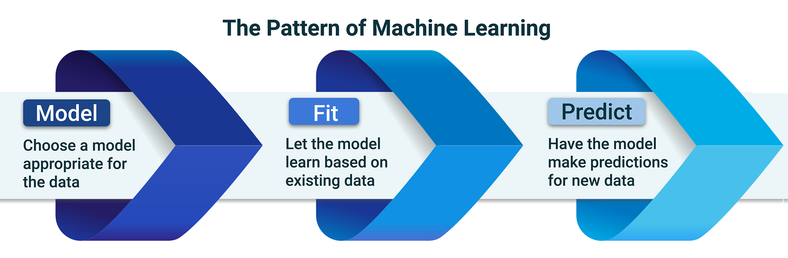
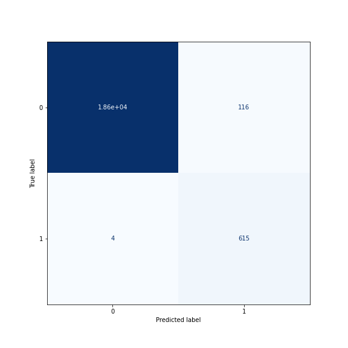

# Module 12 Report Template

## Overview of the Analysis

In this section, describe the analysis you completed for the machine learning models used in this Challenge. This might include:

* Explain the purpose of the analysis.

Using imbalanced-learn and scikit-learn libraries,  evaluate two machine learning models by using resampling to determine which is better at predicting credit risk. First, we used the orginal dataset to model and fit the data.  Next, we  use the oversampling **RandomOverSampler** from **Scikit.learn** to create and train another model. Lastly, we view the count of the target classes, train a logistic regression classifier, calculate the balanced accuracy score, generate a confusion matrix, and generate a classification report.

* Explain what financial information the data was on, and what you needed to predict.

For this excersise we use a dataset of historical lending activity from a peer-to-peer lending services company to build a model that can identify the creditworthiness of borrowers.  The provided data includes loan_size, interest_rate, borrower_income, debt_to_income, num_of_accounts, derogatory_marks,and  total_debt.  The dataset also includes our target variable **Loan Status'**.  Since the labeled **'Loan Status'** contains either a value of 0  meaning that the loan is healthy, or a value of 1 meaning that the loan has a high risk of defaulting.  We will select a model that minimizes the false positives (incorrectly predicted healthy loans)in the 0 class and the false negatives(loans the we failed to predict as unhealthly) in the 1 class.  However, we belive that we should seek to minimize the incorrectly predicted healthy loans because because these loans will not be priced appropriately to handle the probability of default, while a false prediction in the unhealthy class is not a risk to the lender, but only falsely punishes the borrower since they will be saddled with an in appropriate rate in order to compensate the lender for incorrectly predicted default risk.

* Provide basic information about the variables you were trying to predict (e.g., `value_counts`).

Let's examine the the labeled data.  First we check the balance of values in the original **target**.  We take note that the dataset is very unbalnced at 97% healthy and 3% uhealthy.  

```
# Check the balance of our target values
y.value_counts()
```

    0    75036
    1     2500  
    Name: loan_status

We therefore determine that the model will benefit by training with resampled data in order to balance the minority class to the majority.  In order to leave the orginal targets unmolested, we first split the data into test and training and observe the following counts in our test and training y variables.

```
# Count the distinct values of the resampled labels data
display(y_train.value_counts())

# Import the RandomOverSampler module form imbalanced-learn
from imblearn.over_sampling import RandomOverSampler

# Instantiate the random oversampler model
# # Assign a random_state parameter of 1 to the model
random_oversampler = RandomOverSampler(random_state=1)

# Fit the original training data to the random_oversampler model
X_resampled, y_resampled = random_oversampler.fit_resample(X_train, y_train)

display(y_resampled.value_counts()
y_resampled.value_counts()
```

    0    56271
    1     1881  
    Name: loan_status, dtype: int64

    0    56271
    1    56271  
    Name: loan_status, dtype: int64

Initally we verify the the test train split presevered the 3% minority class.  Next, We note that after resampling the original minority class is now appropriately in balance with the majority class.

* Describe the stages of the machine learning process you went through as part of this analysis.




   ### 1.  Model
    A machine learning model mathematically represents something in the real world. A model starts as untrained.
    That is, we haven’t yet adjusted it to make sense of the data. 
    
   ### 2.  Fit
    The fit stage (also known as the training stage) is when we fit the model to the data. The fit stage of supervised
    learning is when the model starts to learn how to adjust (or train) itself to make predictions matching the data       that we give it.

   ### 3.  Predict
    Once the model has been fit to the data (that is, trained), we can use the trained model to predict new data. 
    If we give the model new data that’s similar enough to the data that it’s gotten before, it can guess (or predict)     the outcome for that data.

* Briefly touch on any methods you used (e.g., `LogisticRegression`, or any resampling method).

We highlight below the various methods that were used in our model evaluation process.

### Method 1: Split the data into training and testing datasets by using `train_test_split`.
```
# Import the train_test_learn module
from sklearn.model_selection import train_test_split

# Split the data using train_test_split
# Assign a random_state of 1 to the function
X_train, X_test, y_train, y_test = train_test_split(X,y, random_state=1)
```
###  Method 2: Fit a logistic regression model by using the training data (`X_train` and `y_train`).
```
# Import the LogisticRegression module from SKLearn
from sklearn.linear_model import LogisticRegression

# Instantiate the Logistic Regression model
# Assign a random_state parameter of 1 to the model
model = LogisticRegression(random_state=1)
# Fit the model using training data
lr_orginal_model = model.fit(X_train, y_train)
```
###  Method 3: Save the predictions on the testing data labels by using the testing feature data (`X_test`) and the fitted model.
```
# Make a prediction using the testing data
y_original_pred = lr_orginal_model.predict(X_test)
```
### Method 4: Evaluate the model’s performance by doing the following:

    * balanced_accuracy_score() - Calculate the accuracy score of the model. 

    * confusion_matrix() - Generate a confusion matrix.

    * classification_report_imbalanced() - Print the classification report.


## Results

Using bulleted lists, describe the balanced accuracy scores and the precision and recall scores of all machine learning models.

* Machine Learning Model 1:
  * Description of Model 1 Accuracy, Precision, and Recall scores.
  
 In order to evaluate the models, we must take a close look at the confusion matrix.  Below we find the confusion matrix for the un-resampled test data.
     
 TP[[18663   102]  
 FP[   56   563]]  

  
Precision – What percent of your predictions were correct?

Precision is the ability of a classifier not to label an instance positive that is actually negative. For each class it is defined as the ratio of true positives to the sum of true and false positives.

TP – True Positives
FP – False Positives

Precision – Accuracy of positive predictions.
Precision = TP/(TP + FP)


Recall – What percent of the positive cases did you catch? 

Recall is the ability of a classifier to find all positive instances. For each class it is defined as the ratio of true positives to the sum of true positives and false negatives.

FN – False Negatives

Recall: Fraction of positives that were correctly identified.
Recall = TP/(TP+FN)

F1 score – What percent of positive predictions were correct? 

The F1 score is a weighted harmonic mean of precision and recall such that the best score is 1.0 and the worst is 0.0. Generally speaking, F1 scores are lower than accuracy measures as they embed precision and recall into their computation. As a rule of thumb, the weighted average of F1 should be used to compare classifier models, not global accuracy.

F1 Score = 2*(Recall * Precision) / (Recall + Precision)

  * Accuracy  = 0.95  
  * Precision 0 class = 1.00, 1 class = .85
  * Recall 0 class = 99, 1 class = .91
  
  
```
# Print the classification report for the model
print(classification_report_imbalanced(y_test, y_original_pred))
```


                   pre       rec       spe        f1       geo       iba       sup

          0       1.00      0.99      0.91      1.00      0.95      0.91     18765
          1       0.85      0.91      0.99      0.88      0.95      0.90       619


* Machine Learning Model 2:
  * Description of Model 2 Accuracy, Precision, and Recall scores.
  
  * Accuracy  = 0.99  
  * Precision 0 class = 1.00, 1 class = .84
  * Recall 0 class = 99, 1 class = .99
```
# Print the classification report for the model

print(classification_report_imbalanced(y_test, y_resampled_pred))
```

                   pre       rec       spe        f1       geo       iba       sup

          0       1.00      0.99      0.99      1.00      0.99      0.99     18765
          1       0.84      0.99      0.99      0.91      0.99      0.99       619


## Summary

Summarize the results of the machine learning models, and include a recommendation on the model to use, if any. For example:

* Which one seems to perform best? How do you know it performs best?

The resampled model drastically outperform the original model as shown below. Although we lose some precision, we gain in both accuracy and recall of the model trained on the resampled data.  We definitely are reccomending that the financial institution use the resampled and balanced model for it loan default prediction.  This is because we do not want to falsely predict healthy when they are likely to default as this will not only lead to unforcasted losses, but the lender will inappropriately set the rate to low for the risk. In this case our model perfomance improves from 56 False Positives in the 0 class for the unbalancedd model, and improves to only 4 errors in the 0 class for the balanced model

## Model Performance
 
### Original Imbalanced Data Model
   

### Resampled and Balanced Data Model


* Does performance depend on the problem we are trying to solve? (For example, is it more important to predict the `1`'s, or predict the `0`'s? )

In this case the most important condition we are trying to predict is that when we make a prediction of 0 (healthy loan) that it is not actually a 1 (unhealty loan). So, yes, model performace does depend on wether you are trying to predict the 0's or the 1's in the lending case.

If you do not recommend any of the models, please justify your reasoning.

## We reccomend the balanced model for lending purposes.
